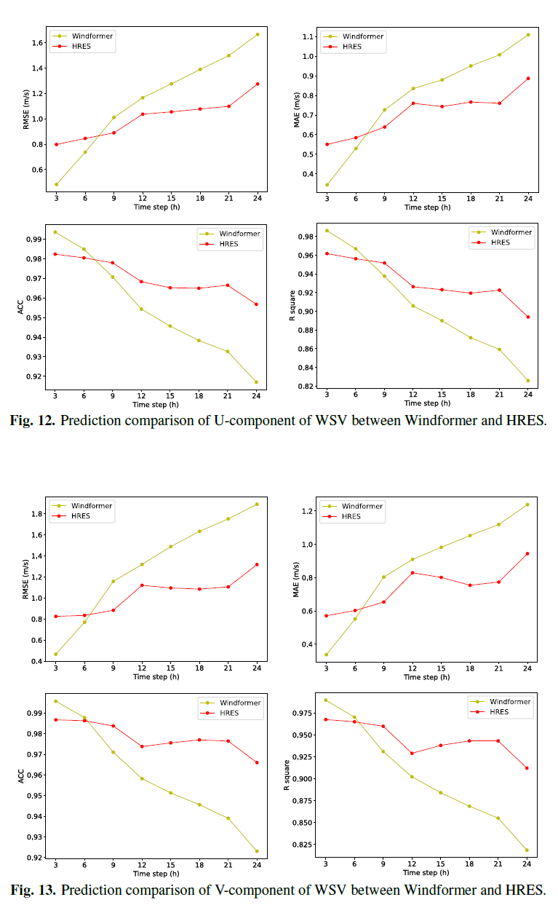

# Windformer
This repository is the implementation of [Windformer: A novel 4D high-resolution system for multi-step wind speed vector forecasting based on temporal shifted window multi-head self-attention](https://www.sciencedirect.com/science/article/pii/S0360544224029815?via%3Dihub)
## Table of Contents
- Model Architecture
- Results
## Model Architecture
The model architecture is as follows:

## Results
The resolution compared between Windformer and HRES is as follows:

